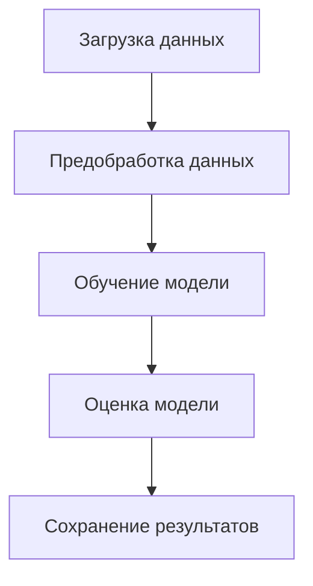
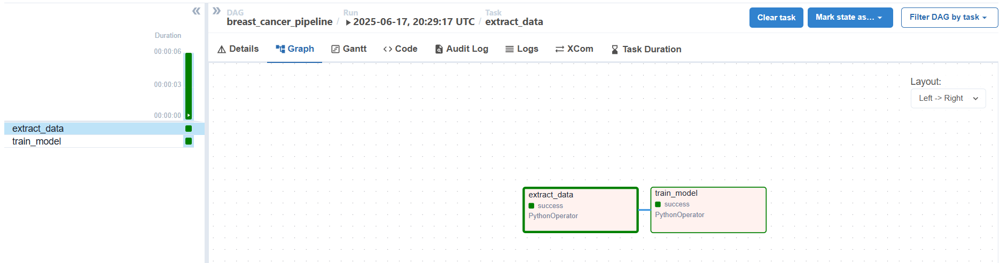

# Автоматизация и оркестрация ML-пайплайна с Apache Airflow

## Цель проекта

Разработка и автоматизация воспроизводимого пайплайна машинного обучения для классификации опухолей молочной железы (доброкачественные / злокачественные) на основе медицинских данных с использованием **Apache Airflow** и **облачного хранилища**.

## Этап 1. Планирование пайплайна

### Формулировка ML-задачи

Тип задачи: **бинарная классификация**  
Классы:
- `M` — злокачественная опухоль
- `B` — доброкачественная опухоль

Используемая модель: `LogisticRegression`  
Метрики качества: `Accuracy`, `Precision`, `Recall`, `F1-score`

### Архитектура пайплайна



### Структура проекта

```plaintext
project/
├── dags/
│   └── pipeline_dag.py         # DAG-файл Airflow
├── etl/
│   ├── load_data.py            # Загрузка и первичный анализ
│   ├── preprocess.py           # Очистка и подготовка
│   ├── train_model.py          # Обучение модели
│   ├── evaluate.py             # Оценка качества
│   └── save_results.py         # Сохранение артефактов
├── results/                    # Финальные артефакты
├── logs/                       # Логи выполнения DAG
├── config.yaml                 # Конфигурация пайплайна
├── .env                        # Переменные окружения
├── requirements.txt            # Зависимости
└── README.md                   # Документация проекта
```

### Этапы пайплайна

| Этап             | Скрипт                 | Описание                                                       |
|------------------|------------------------|----------------------------------------------------------------|
| Загрузка данных  | `etl/load_data.py`     | Загрузка исходного CSV, базовая проверка и сохранение          |
| Предобработка    | `etl/preprocess.py`    | Очистка данных, нормализация, разбиение на train/test          |
| Обучение модели  | `etl/train_model.py`   | Обучение модели `LogisticRegression` и сохранение              |
| Оценка модели    | `etl/evaluate.py`      | Расчёт метрик: Accuracy, Precision, Recall, F1                 |
| Сохранение       | `etl/save_results.py`  | Сохранение модели и метрик локально или в облако               |


## Этап 2: Разработка ETL-компонентов

В этом этапе реализованы отдельные Python-скрипты, выполняющие этапы обработки данных, обучения и сохранения результатов. Все скрипты могут быть запущены как вручную, так и через Apache Airflow, принимают аргументы командной строки, и сохраняют промежуточные артефакты.

### `etl/load_data.py`
Загружает исходный CSV-файл (`wdbc.data.csv`), удаляет столбец `id`, задаёт названия признаков и сохраняет результат в `results/data_loaded.csv`.

### `etl/preprocess.py`
Осуществляет:
- кодировку меток (`M` → 1, `B` → 0),
- масштабирование признаков (`StandardScaler`),
- разбиение на `X_train`, `X_test`, `y_train`, `y_test`.

Сохраняет данные в `.pkl` формате в `results/`.

### `etl/train_model.py`
Обучает модель `LogisticRegression` на `X_train` и `y_train`.  
Сохраняет модель в `results/model.pkl`.

### `etl/evaluate.py`
Вычисляет метрики качества модели:
- Accuracy
- Precision
- Recall
- F1-score

Сохраняет метрики в `results/metrics.json`.

### `etl/save_results.py`
Финальный этап. Копирует итоговые артефакты (`model.pkl`, `metrics.json`) в папку `results/final/`, моделируя "выгрузку в хранилище". Готово для замены на облачную интеграцию при необходимости.

---

Все скрипты поддерживают передачу параметров через `argparse` и могут быть использованы в Airflow как задачи `PythonOperator`.

## Этап 3. Оркестрация пайплайна с помощью Airflow (файл — в `dags/`)

**Название DAG**: `breast_cancer_pipeline`  
**Расположение DAG-файла**: `dags/breast_cancer_dag.py`

### Зависимости между задачами

Пайплайн включает две задачи:

1. `extract_data` — загружает датасет breast cancer из sklearn, сохраняет его как `dataset.csv` в `/tmp/breast_cancer/`
2. `train_model` — обучает модель `RandomForestClassifier`, сохраняет модель (`model.pkl`) и точность (`metrics.txt`) в `/tmp/breast_cancer/`
3. `save_results` — копирует артефакты из `/tmp/breast_cancer/` в `~/airflow_project/results/YYYY-MM-DD/`

Зависимость между задачами:

```
extract_data → train_model → save_results
```

Обе задачи реализованы с использованием `PythonOperator`. Пайплайн настраивается на ежедневный запуск (`@daily`) и не требует `catchup`.

---

### ▶️ Инструкция по запуску DAG

#### Через терминал:

```bash
# Прогон extract_data на 17 июня 2025
airflow tasks test breast_cancer_dag extract_data 2025-06-17

# Прогон train_model на ту же дату
airflow tasks test breast_cancer_dag train_model 2025-06-17
```

#### Через Airflow UI:

- Откройте интерфейс по адресу `http://localhost:8080`
- Найдите DAG с именем `breast_cancer_dag`
- Включите тумблер слева от названия
- Нажмите **Trigger DAG** в правом верхнем углу

---

### 🖼️ Визуализация DAG


---

### 📦 Результаты выполнения (артефакты)

Все выходные файлы сохраняются в директорию `/tmp/breast_cancer/`:

- `dataset.csv` — исходные данные;
- `model.pkl` — обученная модель;
- `metrics.txt` — точность модели (`accuracy`).

---

### 📝 Примечания

- Логирование задач осуществляется стандартным механизмом Airflow (`~/airflow/logs/...`).
- В качестве планировщика используется `SequentialExecutor` с SQLite (для локального запуска).

## Этап 4. Интеграция с локальным хранилищем

### Что реализовано

На этом этапе пайплайн дополнен задачей сохранения результатов (обученной модели и метрик) на **локальный диск**. Используется подкаталог `results/`, отсортированный по дате выполнения DAG.

### Описание интеграции

После завершения пайплайна результаты (модель и метрики) автоматически копируются из временной папки `/tmp/breast_cancer` в постоянное локальное хранилище проекта: `~/airflow_project/results/YYYY-MM-DD/`, где `YYYY-MM-DD` — это дата исполнения DAG.

Интеграция реализована в Python-функции `save_to_local`, подключаемой как `python_callable` в задаче `save_results`. Эта функция получает `execution_date` и использует её как имя подкаталога.

### Место хранения ключей

Для локального хранилища ключи и авторизация **не требуются**. Все действия происходят в пределах локального пользователя Airflow в WSL.

### Структура хранения, формат и логика использования

```
airflow_project/
├── dags/
│   └── breast_cancer_dag.py
├── results/
│   └── 2025-06-17/
│       ├── model.pkl
│       └── metrics.txt
```

- `model.pkl` — сериализованная модель `RandomForestClassifier`, сохранённая через `joblib`.
- `metrics.txt` — текстовый файл с Accuracy, например: `Accuracy: 0.9649`.

### Пример вызова задачи сохранения
```bash
airflow tasks test breast_cancer_pipeline save_results 2025-06-17
```

### Пример содержимого файла `metrics.txt`
```
Accuracy: 0.9474
```
### Пример кода из DAG (функция `save_to_local`)

```python
def save_to_local(execution_date=None, **kwargs):
    date_str = execution_date.strftime('%Y-%m-%d') if execution_date else datetime.today().strftime('%Y-%m-%d')
    source_dir = '/tmp/breast_cancer'
    target_dir = f'/home/user/airflow_project/results/{date_str}'
    os.makedirs(target_dir, exist_ok=True)
    for fname in ['model.pkl', 'metrics.txt']:
        src = os.path.join(source_dir, fname)
        dst = os.path.join(target_dir, fname)
        if os.path.exists(src):
            with open(src, 'rb') as fsrc, open(dst, 'wb') as fdst:
                fdst.write(fsrc.read())
```

**Важно:** путь `/home/user/airflow_project/` предполагает использование WSL. Если используется другая ОС — адаптируйте путь под окружение.
